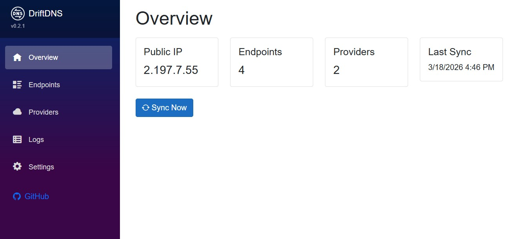
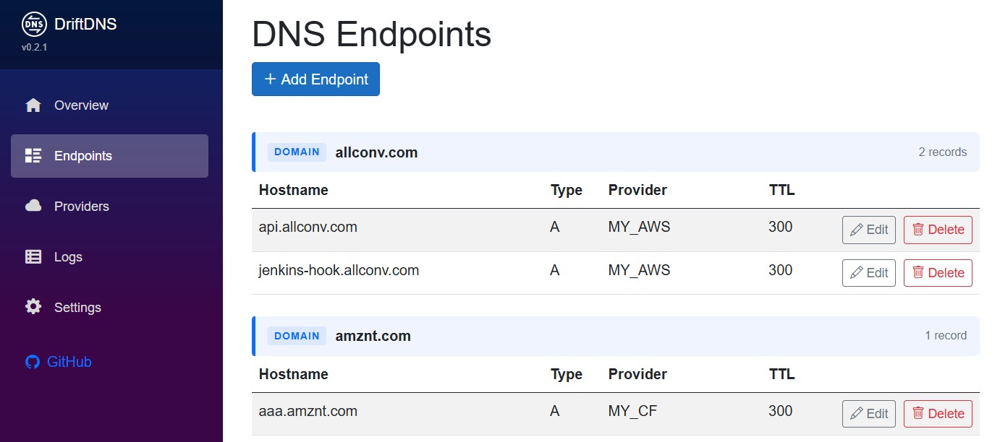
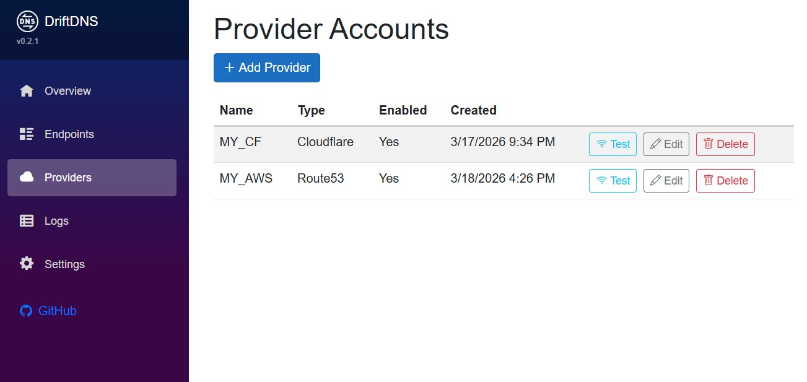
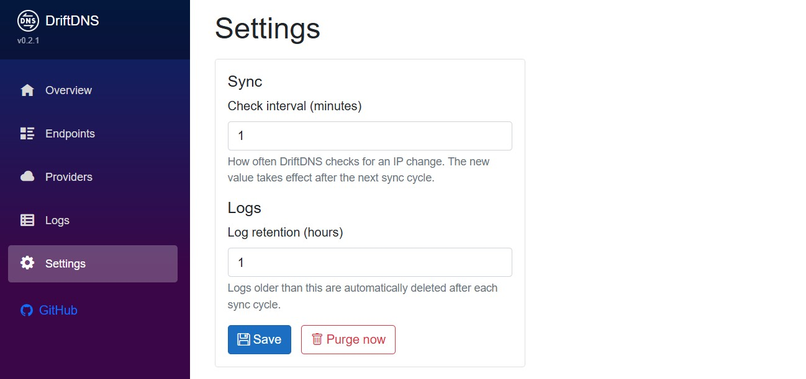

# DriftDNS


DriftDNS is a self-hosted **Dynamic DNS manager with a web dashboard**, designed for homelab users and developers running services behind a dynamic public IP.

It automatically detects your public IP address and updates DNS records on supported providers, making it easier to keep self-hosted services reachable without relying on custom scripts.

---

## Why DriftDNS?

Many people run services from home networks such as Home Assistant, Plex, VPN servers, NAS devices, and other self-hosted apps. Most ISPs assign **dynamic public IP addresses**, which means DNS records must be updated whenever the IP changes.

DriftDNS solves this by automatically:

1. Detecting your current public IP
2. Comparing it with the last known value
3. Updating your DNS records when the IP changes

Unlike simple DDNS scripts, DriftDNS also provides:

- a web dashboard
- manual sync controls
- sync logs and history
- support for multiple DNS providers
- an extensible provider architecture

---

## Common Use Cases

- exposing Home Assistant or NAS from a home network
- running a VPN server with a dynamic IP
- hosting personal services (Nextcloud, Plex, etc.)
- managing multiple domains across providers

---

## Features

- Automatically keeps your DNS records in sync with your public IP
- Self-hosted, single container
- Web dashboard
- Configurable sync interval
- Sync logs with configurable retention
- Manual sync trigger
- Provider abstraction layer
- credentials are stored securely (not in plain text)

---

## Screenshots

### Dashboard – overview of current IP and sync status


### Endpoints – manage DNS records and providers


### Providers - manager different providers with its own credentials


### Settings - tweak application settings


---

## Supported DNS Providers

| Provider | Status |
|---|---|
| AWS Route53 | Stable |
| Cloudflare | Stable |
| Azure DNS | Planned |
| Google Cloud DNS | Planned |

---

## Quick Start

### Docker Compose (recommended)

```yaml
services:
  driftdns:
    image: catokx/driftdns:latest
    container_name: driftdns
    restart: unless-stopped
    ports:
      - "8080:8080"
    volumes:
      - driftdns-data:/app/data

volumes:
  driftdns-data:
```

```bash
docker compose up -d
```

### Docker Run

```bash
docker run -d \
  --name driftdns \
  --restart unless-stopped \
  -p 8080:8080 \
  -v driftdns-data:/app/data \
  catokx/driftdns:latest
```
(you can also pin a specific version using catokx/driftdns:0.2.0 or different image)

Then open: http://localhost:8080 and configure your DNS provider and endpoints from the dashboard.

---

## Configuration

All configuration is done through the **Settings page** in the dashboard (sync interval, log retention).

To run on a different host port, change the port mapping in your Docker setup:

```yaml
ports:
  - "9090:8080"   # DriftDNS will be available on port 9090
```

<details>
<summary>Advanced environment variables</summary>

| Variable | Default | When to change |
|---|---|---|
| `DatabasePath` | `/app/data/app.db` | If using a custom bind mount path instead of a named volume |
| `ASPNETCORE_URLS` | `http://+:8080` | If you need to change the internal listening port |

</details>

---

## Updating

**Docker Compose:**
```bash
docker compose pull
docker compose up -d
```

**Docker Run:**
```bash
docker pull catokx/driftdns:latest
docker stop driftdns
docker rm driftdns
docker run -d \
  --name driftdns \
  --restart unless-stopped \
  -p 8080:8080 \
  -v driftdns-data:/app/data \
  catokx/driftdns:latest
```

The named volume `driftdns-data` persists across updates, so your data is safe.

---

## Architecture

Built with:

- **ASP.NET Core 9** + **Blazor Server**
- **Entity Framework Core** + **SQLite**

```
src/
  DriftDNS.App                    # Blazor Server application
  DriftDNS.Core                   # Models and interfaces
  DriftDNS.Infrastructure         # EF Core, services
  DriftDNS.Providers.Route53      # AWS Route53 provider
  DriftDNS.Providers.CloudFlare   # CloudFlare provider

tests/
  DriftDNS.Tests                  # NUnit test suite
```

---

## Security

DriftDNS stores provider credentials locally for automation purposes.

Recommendations:

- use provider credentials with the minimum required permissions
- restrict access to the DriftDNS dashboard
- keep your container and host system updated
- back up your application data regularly

---

## Contributing

Contributions of any kind are welcome — new providers, bug fixes, UI improvements, and ideas.

Here's how to get started:

1. Fork the repository
2. Create a feature branch (`git checkout -b feature/my-feature`)
3. Make your changes, following the existing code style
4. Add or update tests as appropriate
5. Open a Pull Request describing what you changed and why

### Adding a new DNS provider

Each provider lives in its own project (`src/DriftDNS.Providers.<Name>`). To add one:

1. Create a new class library project `DriftDNS.Providers.<Name>`
2. Implement `IDnsProvider` from `DriftDNS.Core`
3. Register it in `DriftDNS.App/Program.cs`
4. Add tests in `DriftDNS.Tests`
5. Reference the new project in `DriftDNS.App.csproj` and `Dockerfile`

### Running tests

```bash
dotnet test
```

---

## Development

Requirements: **.NET 9**, **Docker**

```bash
dotnet run --project src/DriftDNS.App
```

---

## Roadmap

Planned improvements:

- Azure DNS provider
- Google Cloud DNS provider
- IPv6 support
- notifications for sync failures
- metrics and monitoring
- improved provider management UX

---

## License

MIT License
